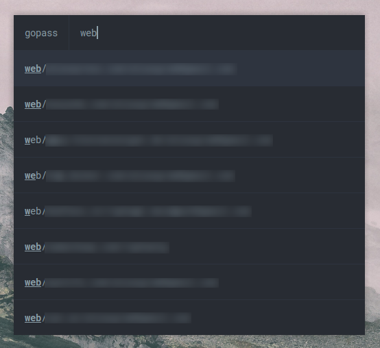

# 🔒 rofi-gopass
This is a simple gopass manager for rofi. It shows the list of passwords from gopass and types the selected entry in the focused input field. 

## Screenshot


## Dependencies
- [rofi](https://github.com/DaveDavenport/rofi)
- [gopass](https://github.com/gopasspw/gopass)
- [xdotool](https://github.com/jordansissel/xdotool)

## Usage
Just execute the script with:

```bash
./rofi-gopass.sh
```

## License
MIT
